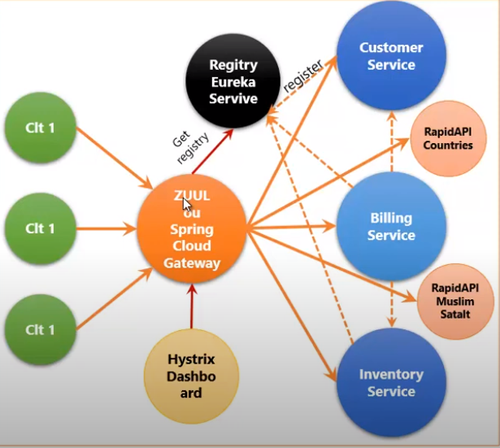

# microservices-spring-boot

Ce projet est une application e-commerce minimaliste pour s'entrainer sur le domaine des microservices.
les technologies : Spring Ecosystem, Feign, Eurika, Zuul ,
Hystrix.

### architcture de l'application :+1: 

